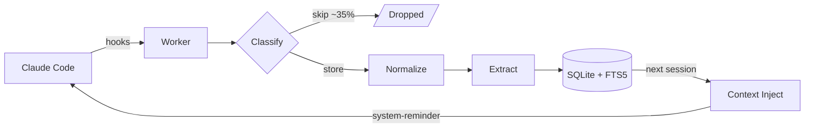
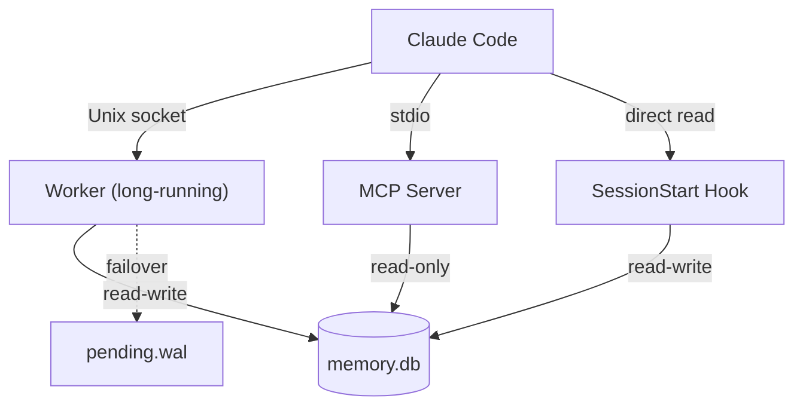

<p align="center">
  
</p>
<p align="center">
  <strong>Claude Code forgets everything between sessions. deja fixes that.</strong>
</p>

<p align="center">
  <a href="https://github.com/firstcontributions/open-source-badges"></a>
  <a href="https://www.npmjs.com/package/@anandt/deja"></a>
  <a href="https://www.npmjs.com/package/@anandt/deja"></a>
  <a href="https://github.com/anandmt/deja/blob/main/LICENSE"></a>
</p>

<p align="center">
  Zero config. 100% local. No API keys.<br>
  Automatic persistent memory for Claude Code.
</p>

<p align="center">
  <a href="#install">Install</a> &middot;
  <a href="#what-gets-captured">Captured Events</a> &middot;
  <a href="#progressive-enhancement">Tiers</a> &middot;
  <a href="#architecture">Architecture</a> &middot;
  <a href="#in-session-recall-mcp-tools">MCP Tools</a> &middot;
  <a href="#cli">CLI</a> &middot;
  <a href="#configuration">Config</a> &middot;
  <a href="#dashboard">Dashboard</a>
</p>

---

## The problem

Every time you start a new Claude Code session, it starts from scratch:

> **You:** "We decided last week to use Postgres for the queue."
> **Claude:** "I don't have context from previous sessions."

**deja gives Claude a memory.** It silently observes your sessions — files touched, commands run, decisions made — and feeds the most relevant context back at the start of every new session.

## Install

```bash
npm install -g @anandt/deja
deja install
```

That's it. Bun is auto-installed if missing. Start a new Claude Code session and you'll see:

```
+- d e j a ---------------------------------+
|                                            |
|  > 142 memories :: 12 sessions :: 3h ago   |
|  > Dashboard :: http://localhost:19533      |
|                                            |
+--------------------------------------------+
```

Behind that banner, Claude receives a context block like this before you type a word:

```xml
<system-reminder>
# deja — project memory for /Users/you/myapp
142 observations across 12 sessions | Dashboard: http://localhost:19533

## Last session
Worked on: auth middleware refactor, migrated session storage to Redis.
Tests passing (47 specs). Deployed to staging.

## Key observations
- [critical] Decision: "Use Postgres for job queue instead of Redis"
- [high] Edit auth.ts — validateToken, refreshSession, AuthService
- [high] Created migration-003-queue-tables.ts
- [critical] Decision: "Rate limiting at API gateway, not app layer"

Use deja_search/deja_timeline/deja_observe MCP tools for deeper memory access.
</system-reminder>
```

No manual tagging. No "save this." No commands to run. It just works.

---

## What gets captured

deja classifies every event and skips the noise. About 30-40% of events are filtered out automatically.

| Event | Example | Stored as |
|-------|---------|-----------|
| Source file edit | `Edit auth.ts — validateToken, AuthService` | `file_edit` / high |
| New source file | `Created migration-001.ts` | `file_write` / critical |
| Build/test command | `npm run build → Compiled successfully` | `bash_cmd` / medium |
| Failed test run | `bun test → 3 failed` | `bash_cmd` / high |
| Architectural decision | *"Let's use Postgres for the queue"* | `decision` / critical |
| Navigation (`ls`, `pwd`) | — | **skipped** |
| Lock file read | `package-lock.json` | **skipped** |
| `node_modules/` read | `node_modules/express/index.js` | **skipped** |

Significance levels: `critical` > `high` > `medium` > `low` > `skip`

---

## Progressive enhancement

deja uses a tiered system. Each tier is additive — **Tier 0 is the full product, not a degraded mode.**

| Tier | What it adds | Cost | How to enable |
|------|-------------|------|---------------|
| **0** (default) | Heuristic extraction + FTS5 full-text search | Free, zero deps | `deja install` |
| **1: AST** | tree-sitter structural parsing — 25+ languages, accurate symbol names in titles and facts | Free, WASM grammars auto-downloaded on demand | `"tiers": { "ast": true }` in [settings](docs/CONFIGURATION.md) |
| **2: Vectors** | sqlite-vec + ONNX local embeddings for semantic search | Free, local model | *Planned* |
| **3: LLM** | Rich narrative summaries via API calls for high-significance events | API costs | *Planned* |

### Tier 1 in action

With AST enabled, observation titles go from generic to precise:

```
Before (Tier 0):  Edit src/auth.ts — modified 3 lines
After  (Tier 1):  Edit auth.ts — validateToken, refreshSession, AuthService
```

Supported languages include TypeScript, JavaScript, Python, Go, Rust, Java, C, C++, Ruby, PHP, Swift, Kotlin, Scala, and [20+ more](src/pipelines/extract/grammar.ts).

---

## Architecture

### Data flow



### Process model

Three separate processes access `memory.db`, coordinated through SQLite WAL mode:



**Design principles:**

- **Pipeline stages are pure functions** — input in, output out, no side effects, independently testable
- **WAL failover** — if the worker is down, events buffer to `~/.deja/pending.wal` with zero data loss; the worker drains the WAL on next startup
- **Lazy worker** — starts on first hook fire, shuts down after 30 minutes idle
- **Multi-session safe** — multiple Claude Code sessions share one worker, events tagged by `session_id`

---

## In-session recall (MCP tools)

Claude can search its own memory mid-session through three MCP tools. They follow a 3-layer protocol to prevent over-fetching:

### `deja_search` — Find observations

Returns a lightweight index. **Always start here.**

| Parameter | Type | Required | Description |
|-----------|------|----------|-------------|
| `query` | string | yes | Search query (FTS5 syntax supported) |
| `project` | string | no | Filter by project path |
| `significance` | enum | no | `low` \| `medium` \| `high` \| `critical` |
| `kind` | enum | no | `file_read` \| `file_edit` \| `file_write` \| `bash_cmd` \| `decision` \| `prompt` |
| `limit` | number | no | Max results (default 20, max 50) |

### `deja_timeline` — Get surrounding context

Shows what happened before and after an observation within the same session.

| Parameter | Type | Required | Description |
|-----------|------|----------|-------------|
| `anchor` | number | yes | Observation ID to center around |
| `depth_before` | number | no | Items before anchor (default 5, max 20) |
| `depth_after` | number | no | Items after anchor (default 5, max 20) |

### `deja_observe` — Full details

Fetches complete observation records. **Hard cap: 10 IDs per request.**

| Parameter | Type | Required | Description |
|-----------|------|----------|-------------|
| `ids` | number[] | yes | Observation IDs to fetch (1-10) |

### Example flow

> **You:** "What was that caching approach we discussed last week?"
>
> Claude calls `deja_search({ query: "caching" })`, finds observation #847, calls `deja_timeline({ anchor: 847 })` for context, then `deja_observe({ ids: [845, 847, 849] })` for full details.

---

## CLI

```
deja install               Install hooks + MCP server (~/.claude/settings.json)
deja uninstall             Remove hooks, stop worker (keeps data)
deja uninstall --purge     Full removal including all data (~/.deja)

deja search <query>        Search observations by keyword
  --project <path>           Filter by project (default: cwd)
  --significance <level>     Filter: low | medium | high | critical
  --kind <type>              Filter: file_read | file_edit | file_write |
                             bash_cmd | decision | prompt
  --limit <n>                Max results (default 20, max 50)

deja stats                 Show project statistics
  --project <path>           Project path (default: cwd)

deja dashboard             Open web dashboard in browser
  --port <n>                 Port (default: 19533)
```

---

## Dashboard

```bash
deja dashboard
```

A local web interface at `http://localhost:19533` for browsing your memory:

- Observation timeline with search, significance filter, and date range
- Session history with auto-generated summaries
- Project-level statistics
- Dark mode (default) and light mode
- Sortable columns, live refresh

---

## Configuration

deja works with zero configuration. Optionally override defaults in `~/.deja/settings.json`:

```json
{
  "context_budget": 8000,
  "tiers": { "ast": true },
  "cross_project": false,
  "debounce_ms": 100,
  "worker_idle_timeout_minutes": 30,
  "log_level": "warn"
}
```

Only specify the values you want to change — everything else keeps its default.

See **[docs/CONFIGURATION.md](docs/CONFIGURATION.md)** for the full settings reference, environment variables, and data directory layout.

---

## Context injection

At session start, deja reads the database directly (not through the worker) and injects context in under 200ms.

**Budget:** 8000 characters by default (~2000 tokens), split across:

| Allocation | Share | Content |
|------------|-------|---------|
| Last session summary | 40% | What happened, decisions made, files touched |
| Top observations | 50% | Highest-significance events across recent sessions |
| Cross-project insights | 10% | Patterns from other projects (opt-in) |

The budget is dynamic — unused allocation from one section flows to the next.

---

## Privacy & storage

**Everything stays on your machine.** No cloud services, no telemetry, no analytics, no network calls (except optional WASM grammar downloads for Tier 1).

- Single SQLite file: `~/.deja/memory.db`
- WAL journal mode for safe concurrent access
- ~250 MB per year at heavy daily use
- No auto-pruning by default (opt-in via `retention` setting)

---

## Platform support

| Platform | IPC | Status |
|----------|-----|--------|
| macOS | Unix domain socket | Fully supported |
| Linux | Unix domain socket | Fully supported |
| Windows | TCP localhost:19532 | Supported (requires manual Bun install) |

---

## Requirements

- **Bun >= 1.3.6** (auto-installed on macOS/Linux if missing)
- **Claude Code**

## Contributing

```bash
git clone https://github.com/anandmt/deja.git
cd deja && bun install
bun test            # 300+ tests
bun run build       # build to dist/
```

Pipeline stages are pure functions — easy to extend. See [CLAUDE.md](CLAUDE.md) for architecture details.

## License

MIT
